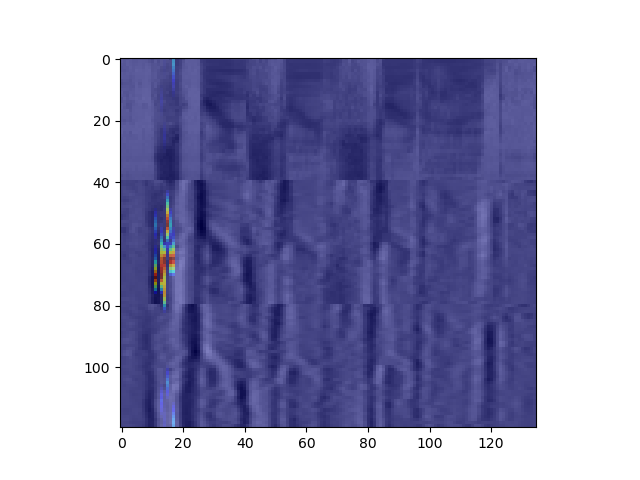

# Forced Alignment via Convolutional Network Activation Maps

In Karaoke, lyrics are presented on screen in time with the appropriate portion of music. The better karaoke systems accomplish this in addition to providing a guide on inidividual word timings as well. The best ones take this even a step further by guiding the singer on a sound-by-sound basis.

## Background

Formally, this is the Forced Alignment problem: aligning an output transcipt with an input sequence song. It is actually a solved problem, but that's no fun. Because of *trends*, I want to approach it from a deep learning perspective rather than the classic methods involing Hidden Markov Models (HMM) or Dynamic Time Warping (DTW). A list of current old-school methods can be found [here](https://github.com/pettarin/forced-alignment-tools) (though it hasn't been updated since 2018).

There are 2 ideas that I wish to focus on to get this done: activation maps and attention.

## Activation Maps

In convolutional networks, with image problems, the concept of activation maps has been shown to effectively show where in the input the network is looking to make its decisions. (cite MAP and GRAD-MAP here) Can this be extended to our use case?

Well, we don't actually use raw waveforms when working with audio usually; instead, we use features such as spectograms or MFCC (cite these wikis), which are images! So we can use convolutional networks on audio as well, which allows us to use these activation maps. 

Now, all we have to do is find an appropriate CNN that does End-to-End Automatic Speech Recognition (ASR), implement it, and see if the heat maps are doing their job to find at what times in the audio we should be looking at.

Here is the model I am using by [Zhang et. al (2017)](https://arxiv.org/pdf/1701.02720.pdf).

Boom, timestamps. And a new idea! (I think)

## Attention (prob not going to explore this)

Using CNNs for audio is a weird choice honestly though. The standard is to use some sort of Recurrent Model, the forefather being RNNs (LSTMs to be specific) (cite this), later improved to the Listen, Attend, Spell (LAS) (cite this) network and its built-upon variants. These have shown superior performance *however* at a much higher computational cost relative to CNNs.

At the heart of these recurrent models is the concept of **attention**, which literally tells the network at what point in the sequential input it should look to process the next step in the output. (tbh this seems like it should be related to activation maps being the analogue to attention in a CNN? look into this). LAS has a very straightforward attention mechanism built-in which gives us exactly what we want.

Is this a new idea? No. I am re-building the wheel here. Will it be fun? Maybe, but I don't have a server of GPUs to train it on, so maybe finding a pre-trained model would be nice. Will it be a good learning experience? Absolutely.

## Progress

**3/15**

The appropriate ASR CNN is implmented with CUDA functionality, but it only learns to output the blank label. This is probably due to not having been trained long enough. While I would, there are 2 outstanding issues:

* The loss clips to NaN. When using maxout, this occurs within the 1st epoch, whereas with PReLU, this occured during the 7th epoch. Training must be stopped then.
* My single RTX 2060 isn't capable of doing the full batchsize of 20 as cited in the paper, so instead I used 3.

Both of these can be remedied by more compute, so progress is stalled until then and a pretrained network is probably a good step from here.

**5/7**

The NaN problem has been solved! AFter moving the log Mel Spectrograms instead of MFCC features, it was observed that NaN loss was being caused by NaNs in the output, which in turn was being caused by NaN's in the input features. This was because of a simple overlooked problem: log(0) = NaN. So when any Mel Spectrogram had a 0 in it, the entire model would break!

The solution: adding a small constant offset to the waveform before taking the log.

Did this fix everything? No. While we were now able to train for 10 epochs and get a steadily decreasing loss, the model still overwhelmingly predicts the blank label. I think digging deeper into CTCLoss and how the weights of the model are being updated will shed some light as to why this is happening.

**5/11**

Looking for a solution to the blank label problem, [this article](http://www.tbluche.com/ctc_and_blank.html) inspired me to train the network for 50 epochs, as it is apparenlty not uncommon for CTC to overwhelmingly prefer the blank label in early training. However, when doing this, something interesting happened: the loss steadily decreased until epoch 10, when it randomly exploded, but stabilized back down (albeit to a relatively higher loss than what it was pre-explosion). Thought we were in the clear? Wrong. At epoch 17, the same explosion happened again, except this time it reached NaN and never recovered :(.

How to fix this? Even though I was using ADAM, I had a hunch that my learning rate was too high (10e-4, which was deceivingly higher than what I thought it was in my mind, it's only .001! Boo me, and kinda the author of the paper I was reading from, for using 10 instead of 1 as the base). Instead, I just switched to a learning rate of 10e-5, or .0001. This did cause the loss to move slower, but it worked without any funny business! Over 50 epochs, it steadily decreased all the way down until it reach a loss of <1.

So, I managed to train the network, but did it help? Kinda. Using just a Greedy Decoder, I get the following result:

    Guessed transcript:  the dus were sufeor to ecs ail and the son had dispurst the miss and wasshetting asstron and clear lit in the forest when the travelers res oumnd their jurny
    True transcript: the dews were suffered to exhale and the sun had dispersed the mists and was shedding a strong and clear light in the forest when the travelers resumed their journey
    
As you can see, it is getting a phonetically similar sentence, but the spellings are atrocious. 

What can we do from here? 

* In CTC literature, it is well-known that using a Greedy Decoder is not the move as it ignores any kind of temporal structure of conditional probability information between characters. So the money move from here is to find/implement a Beam Search with a Language Model.
* Train on the dev set as well for fine-tuning. I'm not sure this is totally necessary since the goal isn't to create a perfect network, but just a working one for something else.

(Fun information: it took around 30 hours to train the whole thing. My room got very hot and the sound of a GPU fan running isn't really the greatest white noise for falling asleep.)

**5/19**

Given a semi-working model, I began working on implementing GRAD-CAM on it, however things turned sour quickly. First, I had to acknowledge the main problem: for a CNN-based ASR model, the output is a matrix of shape `(# labels, time)`, so a single "class label" that CAM likes to use is not well-defined to take the gradient with respect to. Each column of this output matrix specifies a separate distribution over the labels, and the output transcript is not easily interpretabable from this: it relies on the sum of all the probabilities of all possible alignments that correspond to the same transcript defined by CTC's assumptions.

This realization shed light on the larger problem with CTC. It's many-to-one (surjective) "collapsing" function (defined as beta in the original paper) is the main cause of 2 of CTC's weaknesses: 

1. It's huge reliance on a good decoding algorithm and language model to get a reasonable error rate
2. Bad interpretability

For example, consider the output transcript "cat" given an input sequence of length 5. There are 28 valid alignments for this that CTC will treat equally. But are they equal? Do `cccat` and `cattt` encode the same information? What about `--cat` vs `cat--`? The bigger question is: **what makes a good alignment?**

So, I propose 4 improvements:

1. Remove the blank symbol. I understand that this is, arguably, the main novelty of CTC, however its removal decreases the space of valid alignments. However, we still need a heuristic for an ideal alignment given that there are still multiple valid ones even without the blank symbol. All of these can be categorized by having repeat labels, whether they are intentional (feel) or not (catt). This motivates Proposal 2.

2. Use phonemes instead of characters. It removes the complexity of spelling that led to reliance on a decoder/LM. In addition, according to [Zhang et. al (2017)](https://arxiv.org/pdf/1701.02720.pdf), CNN-based models for ASR work better on phonetic information. To do this, we can use the TIMIT dataset. We also use the assumption that no English word has 2 neighbor repeat phonemes, which forces a 1-to-1 conversion from an alignment to the transcript. Why? Given that we are using the CTC method of collapsing alignments by 1) collapsing repeats then 2) removing blanks, repeats no longer exist via this Proposal, and blanks no longer exist by Proposal 1. So no collapsing is even necessary! To separate words (remember the original idea here is to look at how the model operates on each word), we will add a `<SPACE>` label in preprocessing using the time-annotations TIMIT provides.

3. It's great that we've removed the need for collapsing altogether, but won't the model have to do that anyway given the output dimensions? Correct. So, let's reduce the dimensionality of the output sequence from `(num_labels, time)` to `(num_labels, transcript length)`.

4. The caveat to Proposal 3 is that across batches, the transcript length differs, so instead of doing this in the model itself, it will be done in the loss function. The new loss function will use an Adaptive Average (or Max) Pooling for each sample within the batch to reduce the dimensions, then compute the Negative Log Likelihood of the singular sequence that is "correct".

Basically, all we are doing is forcibly decreasing the space of valid alignments, by only allowing 1 to be valid. That is, the actual transcript itself. No decoding necessary (except for a phonemes-to-word model). For example instead of `cat`'s 28 valid alignments with CTC in a length 5 input sequence (e.g. `c-a-t, caatt, -c-at`, etc), there is only 1: `k ae t`.

**5/29**

I integrated TIMIT, preprocessed to create the input/outputs desired, and created the custom loss function that I've named "Collapsed CTC". 

Did it work? After 20 epochs, it did **not**. The loss jumped around within the same range, showing no signs of decreasing. Maybe it needs hyperparameter tuning? Maybe I'm asking for too much from the model. For the sake of clarity, I did not follow the standard practice on training on 61 training labels then moving to the 39 test labels. Instead, I just used the 39 labels for training as well.

Perhaps I should return to what makes an ideal alignment and create a better objective loss function...

**6/15**

Ok, new idea. Instead of forcing this pooling in the time dimension, why don't I use the same resolution as the input for the length of the transcript? CTC used the input lengths, why don't we use them as well? So I won't collapse the phonemes at training, but instead **incorporate the duration of the phoneme**. This speaks directly to the ideal alignment being one which encodes duration of sounds as well. Lucky for me, TIMIT actually provides the duration of each phoneme and word (wow I feel sorry for the soul who had to do that).

An example output transcript would be as follows: given the word `cat` with duration 6, `k` occurs from `{1, 2}`, `ae` from `{3, 5}`, and `t` from `{6}`, the target would be `k k ae ae ae t`. An alignment with meaningful repeats and without blanks. As I did before, we can use the timing for words/phonemes to know which phoneme is part of a new word and insert a `<SPACE>` appropriately.

There is only one small implementation detail of note: the dimension of time provided by TIMIT (waveform time) doesn't match our time dimension for the network input where we use spectrograms (spectrogram time). So, with a little bit of math, I broke down how PyTorch does its STFT, extracted the appropriate parameters and created a mapping between these time dimensions. Using Pytorch default arguments, it moves its STFT window by half the window size each hop, so each time in the waveform time dimension corresponds to 2 times in the spectrogram dimension. This is ok; I will just arbitrarily choose to use the first valid spectrogram time. I'm pretty sure this won't cause any problems. (It would only really be a problem if 2 different phonemes were mapped to the same spectrogram time, but for that to happen a new phoneme would have to be started and stopped in `24 ms`, since the default window size is 400 samples and we're sampling at `16.5 kHz`, and this is highly unlikely.)

Lastly, I've decided to use the full 61 phonemes for training. Honestly, I'm doing this because one phoneme (`q`) is collapsed to `None` for the 39 (which is not a label,  it's just straight up nothing), and that annoyingly messes up the output transcript and its length since I have collapsing done after the new phoneme-style output transcripts are generated.

I'll use the same deep CNN model as before with a slightly modified Negative Log Likelihood Loss. Train for 20 epochs or something... It's also 90 degrees here so training will make my room a true pleasure to be in.

**6/17**

I trained it for 20 epochs. Around epochs 11, 17, and 18 the network escaped and jumped to a high value that it never recovered from. Regardless, 10 solid epochs of training were done with a steadily decreasing loss!

But, how did it fare with decoding? Well, it actually did quite well! The network is classifying the sounds to the correct phonemes for the appropriate durations with a pretty high accuracy. I should probably implement a Phoneme Error Rate to be thorough. However, one thing to note: the network still lacks the ability to classify something as a `<SPACE>`, which kinda makes intuitive sense. Just like how in CTC, the blank didn't actually represent a sound, the `<SPACE>` functions similarly. But, we do need these spaces as they provide the word boundaries that allow for interpretability on a word-level.
    
 At this point, I could implement GRAD-CAM on a phoneme level, but I'm not interested in that. Next step will be to figure out how to extract word-level information from these transcripts. We got our ideal alignment (woohoo), but maybe I'll need to give a little lee-way in terms of post-processing. Maybe a little sprinkle of a language model? I also need to figure out the whole phoneme-to-word thing. I believe TIMIT comes with a file that could help me out there.

**7/1**

Big design decisions were necessary. It was decided to forgo investigating phonemes-to-words as that is a whole other can of worms involving things like Language Models, which we are trying to move away from. In addition, the `<SPACE>` was left behind as well. As a feature that is too high level, it doesn't make intuitive sense to ask a CNN trained on raw spectrograms to learn word boundaries. This also simplifies a lot of the coding logic as there's no more confusion over crossing word boundaries which exist in TIMIT. Instead, let's focus on what we have: a fantastic phoneme recognizer. 

After removing the `<SPACE>` label, I retrained the network one more time for 15 epochs with a smaller learning rate, `10e-5`, to avoid jumps. In addition, to quantify our results, I also implemented a Phoneme Error Rate via the Levenshtein Distance. And the results were... an average PER of `5.22%` on the TIMIT test set with the 39 collapsed test phonemes! Nice. I'm considering adding a "duration" error signal to see how well the network is learning the durations, but I'm not sure that's totally necessary as the PER is already accounting for misclassifications, which include classifying for the proper duration.

In addition, at this point, we do have interpretability at the phoneme level, so we can try our GRAD-CAM now: find the duration of a singular phoneme and superimpose their heatmaps on top of each other. Keeping in mind our forced alignment goal, I'm thinking that, in place of a phoneme-to-word thing, I can utilize the fact that we have the lyrics/transcript. What if we throw that into the TIMITDIC (which has phoneme transcriptions for a bunch of words) and compare those to the guessed transcript? We even have word boundaries that come with that.

**7/3**

So I implemented all the GRAD-CAM logic so that it uses the activations and gradients of the final convolutional layer. In addition, the code can now take in single samples to pass into the model, which will be useful for later if I ever get around to using this in the overall Karaoke pipeline. Plus, I added extra functionality that allows for looking at multiple classes' activations at the same time by taking the element-wise maximum of each individual CAM. However, upon seeing the results of GRAD-CAM, a significant detail was brought to my attention that brings the usefulness of GRAD-CAM in our situation into question.

In our network, we first flatten the activation maps of the final convolutional layer, which are of shape `(batch x channel x feature x time)` before flattening and `(batch x time x channel * feature)` after (plus a dimension transposition to make it compatible with the expectation of Pytorch's Linear module). These are fed into the fully connected layers, which only do work in a single dimension: the flattened feature one. However, there still exists the time dimension, so what happens to it? Nothing, really. The first Linear module in Pytorch applies a 2-dimensional weight matrix to the input Tensor of shape `(out_features x in_features) = (channel * feature x 1024)`, and our features are the acoustic features in the feature dimension, not the time one. So the model is actually applying this *same weight matrix to each unique timestep in parallel*. 

What does this mean wrt GRAD-CAM? Well, that method uses a weighted combination of the entirety of the activation maps, but in our model, the Linear weight matrix is being applied to only a single time-slice of these last layer activation maps. So if we were to use vanilla GRAD-CAM on a specific class at a certain timestep, we would be getting the correct gradients only existing during that timestep in the last conv layer, but those will be used to weigh the last layer activations that are spanning every timestep.

It seems GRAD-CAM is not the move here with its reliance on layer activations. I guess this opens up the question of how should we add interpretability to a Convolutional model that works with sequential input? Perhaps I should just use a simplier saliency map or something that just uses the gradient. 

**7/4**

After writing the previous post, I drew a nice diagram for myself to see if I would find anyting I wasn't seeing before in how GRAD-CAM works on our network, and it was successful! In a normal CNN, the entire last layer activations are flattened into a singular vector that is passed through the FC layers. But in ours, the time dimension is left alone. So to be analagous to GRAD-CAM, what we need to do is *only look at the last layer activations during the timesteps we care about!*. (I should probably upload my diagram somewhere because it shows how I concluded this in a clearer way. Also the previous post included an incorrect undersanding of this process as well, so that was updated.)

Did this work? Was my logic correct? Yes and yes. Below is the modified GRAD-CAM for a phoneme that is classified as occurring within timesteps 10 and 18.

Sometimes, the ReLU'd activations end up just giving us an all 0 activation map. In addition, there seems to be high variance among the cams that are combined across neighboring timesteps, so certain classes will make other classes' cams disappear in the final result. Normalizing each one before combining will alleviate this problem.

A nice side-effect of this is that now we actually get interpretability in CTC! How? Well, with this modified GRAD-CAM, we can generate activation maps for sequential outputs, which CTC generates. The difference, still, is that knowing which classes to generate these CAMs wrt is not immediately clear? Should it be the greedy decoding result? The beam-searched result? These are options left open and could lead to varyingly successful results. Whatever though, our method makes it clear which classes they should be: the greedy one is the optimal alignment.

**7/16**

With GRAD-CAM done, I could focus my efforts on the final problem where everything began: forced alignment. With the output of the model being a phonetic transcript of the audio, the motivating question became: *how can we learn word boundaries*?

Normally, as is usually done in the literature, a phoneme-to-word model is the move here. However, I had decided to forgo a this approach, not for a mathematical reason, but because I thought of a simpler way (though it may be worth later trying the phoneme-to-word and calculating the WER). My approach, though, did use a word-to-phoneme model since that was easily implmeneted. Using the CMU Pronuncaton dictionary that utilizes ARPABET (that closely resembles TIMIT), my "word-boundary-finding" algorithm relied on the Levenshtein distance.

To put it simply, I computed the edit distance between our guessed transcript (39-phonemes, collapsed repeats similar to the original TIMIT phoneme transcripts), and compared that to the ground truth phonetic transcript. The pronunciation dictionary was the MVP here when it came to genereating the ground truth transcrpits: iterate over each word, get a pronunciation (for now, I arbitrarily chose the first one), and separate them by `<sp>` tokens. Compute the edit distance, which generates the edit path as a byproduct, find the index where the `<sp>` should be aligned with our guess, and insert them there. With the spaces between the appropriate phonemes, all we had to do was re-expand this transcript with the durations we had from the model output, and there we have it: a transcript with phoneme accuracy/duration and word boundaries.

The very last step was to get the waveform times for the alignment, since our transcript is mapping each spectrogram-timestep to a phoneme, but recall that our original ORIGINAL input was a waveform. This was just some reverse math for what we did earlier in preprocessing going from waveform to spectrogram. (Side note, when reviewing my old math, I did notice a math bug in our code for preprocessing, so I need to retrain bleh).

And voila! Forced alignment complete! In addition, with the locations of the spaces in the transcript, I can also plug that into our GRAD-CAM pipeline to see the heatmap for an entire word. At the moment, I don't have a error metric for how good our alignments are. For now, I'm thinking to do something like an Alignment Error Rate which would be an averaged percent difference between the alignment times (I'll use only the end times since ends of previous words correspond to starts of the next, so it'd be redudant. In addition, I am omittnig the error for the end of the last word since I don't reeeally care when we say the last word ends, only when it starts, and that's covered by the end of the second-to-last word.) Here is an example: 

    Results for sample TRAIN/DR4/MESG0/SX72 in TIMIT

    Our guess:
    [{'word': 'spring', 'start': 0, 'end': 8000}, 
    {'word': 'street', 'start': 8000, 'end': 13600}, 
    {'word': 'is', 'start': 13600, 'end': 14200}, 
    {'word': 'straight', 'start': 14200, 'end': 19400}, 
    {'word': 'ahead', 'start': 19400, 'end': 27000}]

    Ground truth:
    2180 8290 spring
    8290 13451 street
    13451 15960 is
    15960 19520 straight
    19520 25140 ahead

    Alignment Error Rate (AER): 4.06%
    

Aside from the small edge cases for the beginning of the first word and end of the last, they're pretty close! For a method where I ~~cut a lot of corners~~ used heuristics, I think this does a good job. I should probably make a note of all the heuristic liberties I took for thoroughness... 